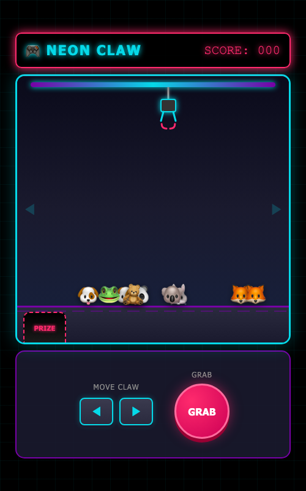

# 🎮 Neon Claw Machine 2D

> 네온 사이버펑크 스타일의 2D 인형뽑기 게임



## ✨ 특징

- 🌈 **네온 사이버펑크 디자인** - 화려한 네온 색상과 글로우 효과
- 🎯 **정밀한 충돌 감지** - 원형 충돌 기반 정확한 인형 잡기
- 📱 **반응형 디자인** - 모바일/데스크톱 모두 지원
- 🎮 **직관적인 조작** - 터치/클릭 & 키보드 모두 지원
- ✅ **Playwright 테스트** - 자동화된 E2E 테스트 포함

## 🚀 시작하기

### 설치

```bash
# 저장소 클론
git clone https://github.com/ComBba/claw-machine-game.git
cd claw-machine-game

# 의존성 설치 (테스트용)
npm install
```

### 실행

```bash
# 브라우저에서 직접 열기
open index.html

# 또는 로컬 서버 사용
npx serve .
```

## 🎮 조작법

| 입력 | 동작 |
|------|------|
| ◀ / ← | 집게 왼쪽 이동 |
| ▶ / → | 집게 오른쪽 이동 |
| GRAB 버튼 / Space | 집게 내리기 |

## 🧪 테스트

```bash
# 헤드리스 테스트
npm test

# UI 모드로 테스트 (브라우저에서 확인)
npm run test:ui

# 브라우저 표시하며 테스트
npm run test:headed
```

### 테스트 시나리오

- 인형 3개 이상 잡기 성공 검증
- 집게 하강/상승 동작 확인
- 충돌 감지 정확도 테스트

## 🛠️ 기술 스택

- **Frontend**: Vanilla HTML5, CSS3, JavaScript (ES6+)
- **Testing**: Playwright
- **Animation**: requestAnimationFrame
- **Collision**: 원형 충돌 감지 (AABB 기반)

## 📁 프로젝트 구조

```
claw-machine-game/
├── index.html              # 게임 메인 파일 (HTML + CSS + JS)
├── claw-machine.spec.ts    # Playwright E2E 테스트
├── playwright.config.ts    # Playwright 설정
├── specs/
│   └── game-mechanics.md   # 게임 메카닉 명세
├── screenshots/
│   └── claw-machine-fixed.png  # 게임 스크린샷
└── IMPLEMENTATION_PLAN.md  # 구현 계획 및 완료 상태
```

## 🎨 게임 메카닉

1. **대기**: 집게가 상단에서 좌우 이동 대기
2. **하강**: GRAB 시 집게 전체가 아래로 내려감
3. **잡기**: 바닥 도달 시 인형 충돌 감지 → 잡기
4. **상승**: 잡은 인형과 함께 집게 중심에 고정되어 올라옴
5. **이동**: 배출구로 이동
6. **배출**: 인형 떨어뜨리고 점수 획득! 🎉

## 🔧 개발 과정

이 게임은 **Ralph Loop** (AI 기반 개발 루프)를 사용하여 개발되었습니다:

1. 명세 작성 (`specs/game-mechanics.md`)
2. 구현 계획 수립 (`IMPLEMENTATION_PLAN.md`)
3. AI 에이전트가 코드 작성 및 버그 수정
4. Playwright 테스트로 검증
5. 반복하여 완성

### 해결된 주요 버그

- ✅ 집게가 줄만 내려가고 몸체는 안 내려가던 버그
- ✅ 인형이 올라올 때 틀어지던 버그
- ✅ 충돌 감지 불안정 이슈

## 📄 라이선스

MIT License

---

Made with 💜 by [ComBba](https://github.com/ComBba) & AI Agents 🤖
