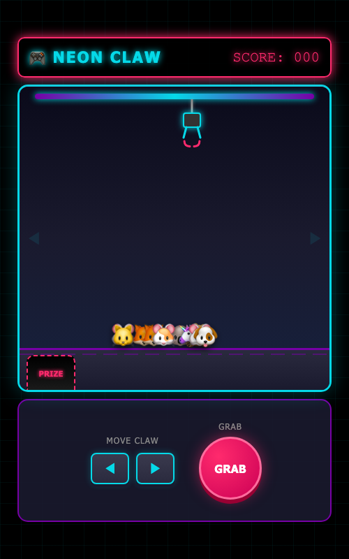

# 🧸 Neon Claw Machine Game

> 🚧 **Work in Progress** - 개발 중입니다!

네온 스타일의 2D 인형뽑기 게임입니다.



## 🎮 플레이 방법

| 입력 | 동작 |
|:---|:---|
| ◀ ▶ / 방향키 | 집게 좌우 이동 |
| GRAB / Space | 집게 내리기 |

## ✨ 특징

- 🌈 네온 스타일 UI
- 📱 모바일 터치 지원
- 🎯 정확한 2D 충돌 감지
- 🔊 효과음 (드롭, 캐치, 승리)
- 💾 점수 저장 (sessionStorage)

## 🛠️ 기술 스택

- HTML5
- CSS3 (Neon effects, Animations)
- Vanilla JavaScript
- Playwright (테스트)

## 🚀 데모

👉 [Play Now](https://combba.github.io/claw-machine-game/)

*(GitHub Pages 설정 후 활성화)*

## 📁 프로젝트 구조

```
├── index.html          # 게임 (단일 파일)
├── screenshots/        # 스크린샷
├── specs/              # 게임 명세
└── claw-machine.spec.ts # Playwright 테스트
```

## 🧪 테스트 실행

```bash
npm install
npx playwright test --headed
```

## 📜 라이선스

MIT License

---

Made with 💜 by [@ComBba](https://github.com/ComBba) & AI Agents 🤖
